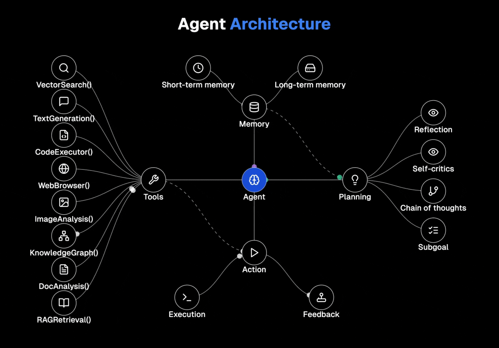

# Agent Nexus

Agent Nexus is an advanced cognitive agent architecture framework that enables AI systems to operate with human-like reasoning abilities. By integrating memory management, specialized tools, strategic planning, and action execution into a cohesive system, Agent Nexus creates agents that can solve complex problems, learn from experience, and provide continuous value.



## Architecture Overview

The Agent Nexus architecture consists of four core components:

1. **Memory**: Divided into short-term (for immediate context) and long-term (for persistent knowledge), allowing the agent to maintain continuity across interactions.

2. **Tools**: A suite of capabilities including:
   - VectorSearch() - Semantic similaritys search
   - TextGeneration() - Context-aware content creation
   - CodeExecutor() - Secure code execution
   - WebBrowser() - Web access and information retrieval
   - (Coming soon) ImageAnalysis(), KnowledgeGraph(), DocAnalysis(), RAGRetrieval()

3. **Planning**: The cognitive center featuring:
   - Reflection - Self-assessment of reasoning processes
   - Self-critics - Error identification and correction
   - Chain of thoughts - Transparent reasoning pathways
   - Subgoal decomposition - Breaking complex problems into manageable tasks

4. **Action**: The execution layer that implements plans and processes feedback to improve future performance.

## Key Advantages

1. **Self-Correction**: The architecture enables agents to critique their own work before execution, significantly reducing errors.
2. **Human-Like Reasoning**: By mimicking human cognitive processes, these agents can solve problems with greater nuance.
3. **Continuous Improvement**: The feedback loop between action and planning creates a system that learns from every interaction.

## Technologies Used

- **Agno**: Lightweight framework for building agents with memory, knowledge, tools, and reasoning
- **claude-task-master**: AI-powered task management system
- **Next.js**: React framework for building the web interface
- **TypeScript**: For type-safe code

## Getting Started

### Prerequisites

- Node.js 18+ and npm/yarn/pnpm
- OpenAI API key (for using the agent)

### Installation

1. Clone the repository:
   ```bash
   git clone https://github.com/yourusername/AgentNexus.git
   cd AgentNexus
   ```

2. Run the setup script:
   ```bash
   npm run setup
   # or
   yarn setup
   # or
   pnpm setup
   ```

3. Add your OpenAI API key to `.env.local`

4. Run the development server:
   ```bash
   npm run dev
   # or
   yarn dev
   # or
   pnpm dev
   ```

5. Open [http://localhost:3000](http://localhost:3000) in your browser to see the result.

## Usage

### Web Interface

The web interface provides a simple way to interact with Agent Nexus. You can:
- Chat directly with the agent
- Submit complex tasks for processing
- View the agent's reasoning process
- Explore the cognitive architecture

### API

You can also interact with Agent Nexus through its API:

```javascript
// Example fetch request
const response = await fetch('/api/agent', {
  method: 'POST',
  headers: {
    'Content-Type': 'application/json'
  },
  body: JSON.stringify({
    message: 'Analyze the performance implications of using vector search in a production environment',
    type: 'task' // or 'chat' for simpler interactions
  })
});

const data = await response.json();
console.log(data.response);
```

### Task-Master Integration

Agent Nexus integrates with claude-task-master for task management:

```bash
# View current tasks
npm run task-master list

# Process the next task with Agent Nexus
npm run process-task
```

### Testing Tools

You can test individual tools with the test-tool script:

```bash
# Test vector search
npm run test-tool -- vectorSearch '{"query":"example search"}'

# Test text generation
npm run test-tool -- textGeneration '{"prompt":"Summarize the benefits of AI","temperature":0.7}'

# Test code execution
npm run test-tool -- codeExecutor '{"code":"console.log(\"Hello, world!\");","language":"javascript"}'

# Test web browser
npm run test-tool -- webBrowser '{"url":"https://example.com","operation":"get"}'
```

## Project Structure

```
/AgentNexus
│
├── src/
│   ├── app/                    # Next.js app
│   │   ├── api/                # API routes
│   │   │   └── agent/          # Agent API endpoint
│   │   ├── page.tsx            # Main page
│   │   └── layout.tsx          # App layout
│   │
│   ├── components/             # UI components
│   │   ├── AgentInterface.tsx  # Agent chat interface
│   │   └── ArchitectureVisualizer.tsx # Architecture diagram
│   │
│   ├── core/                   # Core Agent Nexus components
│   │   ├── agent.ts            # Main Agent class
│   │   ├── memory/             # Memory system components
│   │   ├── tools/              # Tools integration
│   │   ├── planning/           # Planning system
│   │   └── action/             # Action system
│   │
│
├── scripts/                    # Utility scripts
│   ├── setup.sh                # Setup script
│   ├── test-tool.ts            # Tool testing script
│   ├── run-first-task.ts       # First task test script
│   └── task-nexus-bridge.ts    # Integration with task-master
│
├── tests/                      # Test utilities and tests
└── tasks/                      # Task definitions for task-master
```

## Development

See [CONTRIBUTING.md](CONTRIBUTING.md) for detailed development guidelines.

### Running Tests

```bash
# Run all tests
npm test

# Run specific tests
npm run test-memory
```

## Roadmap

1. **Additional Tools**: Complete implementation of remaining tools (ImageAnalysis, KnowledgeGraph, DocAnalysis, RAGRetrieval)

2. **Advanced Memory System**: Connect to vector databases and implement memory consolidation

3. **Enhanced Planning**: Improve reasoning with more sophisticated models and strategies

4. **User Interface Improvements**: Add visualization for agent's thought processes

5. **Multi-Agent Orchestration**: Enable multiple agents to work together

## License

This project is licensed under the MIT License - see the LICENSE file for details.

## Acknowledgements

- [Agno](https://github.com/agno-agi/agno) - For the agent framework
- [claude-task-master](https://github.com/eyaltoledano/claude-task-master) - For the task management system
